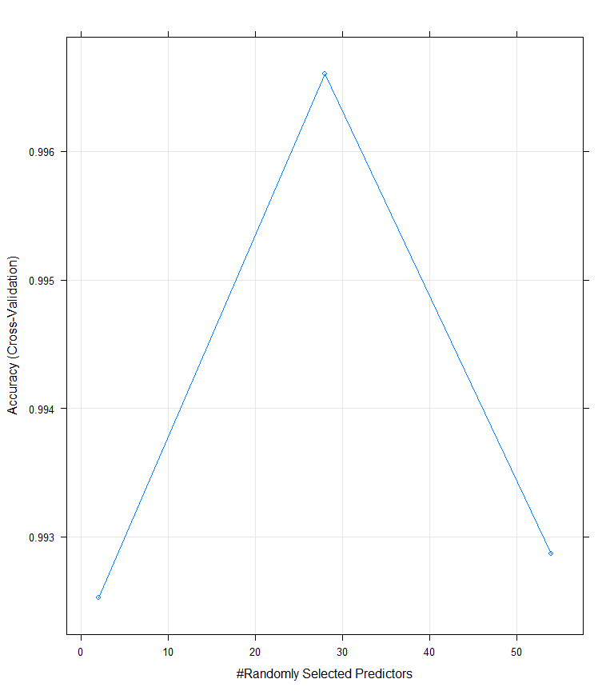
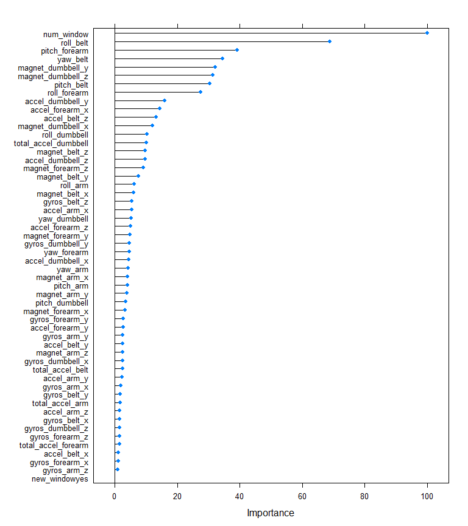

# Machine Learning Project
JahlaJazz  
October 2, 2016  


# Excutive Summary

The focus of this project is to predict the manner in which the Unilateral Dumbbell Biceps Curl excercise was performed by a group of six participants, ranging in age from 20 to 28. Each particpants was asked to perform the excercise in five different ways, while wearing electronic devices designed to record various measurements, of the activity. Following is a listing of the ways in which the excercise was performed, of which only the first, is viewed as correct.

  * classe A: exactly according to specification (ie, the correct way to do a curl)
  * classe B: throwing the elbows to the front
  * classe C: lifting the dumbbell only halfway
  * classe D: lowering the dumbbell only halfway
  * classe E: throwing the hips to the front
  
The results from the electronic readings and "classe" (the target variable) was recorded and a data set of 19,622 samples with 160 variable was used as the starting point for creating a model. According to the instruction, any combination of variable can be used to create the model and must be validated against another data set of 20 samples, from which the "classe" variable is to be assigned, based upon the variables for each sample.

To accomplish this task, a random forest model was used, with 5-fold cross validation and a tree depth of 50. Following is a summary of the results and the sections, in the appendix, supporting the conclusion.

  * Section 1 : the fitted model was based upon 14,718 samples and 54 predictors for a classification regression on the target variable of "classe". With 5-fold cross validation an accuracy rate of 99.7% was achieved with an out of sample error of .22%
  * Section 2, provides the confusion matrix for the target variable and provides a 95% condfidence interval of 99.6% to 99.9% for the range of overall accuracy
  * Section 3 provides a visual of the relationship between selected predictors versus the level of accuracy with cross-validation. It shows that accuracy increase, when regressing with 2 to 28 predictors, but decrease when using more.
  * Section 4 shows a listing of the most important predictors and Section 5 is a visual representation of the same.
  * Section 6 shows the resulting predictions based upon the validation data set.

# Background Information 

The following section was taken from the instructions provided with this project:

"Using devices such as Jawbone Up, Nike FuelBand, and Fitbit it is now possible to collect a large amount of data about personal activity relatively inexpensively. These type of devices are part of the quantified self movement - a group of enthusiasts who take measurements about themselves regularly to improve their health, to find patterns in their behavior, or because they are tech geeks. One thing that people regularly do is quantify how much of a particular activity they do, but they rarely quantify how well they do it. In this project, your goal will be to use data from accelerometers on the belt, forearm, arm, and dumbell of 6 participants. They were asked to perform barbell lifts correctly and incorrectly in 5 different ways. More information is available from the website here: http://groupware.les.inf.puc-rio.br/har (see the section on the Weight Lifting Exercise Dataset)."

# Data Sources and Explaination on Usage

1. The training set is available here: https://d396qusza40orc.cloudfront.net/predmachlearn/pml-training.csv 
     * this data set is represented as the "build" object.
     * the build object will be used to create the training and test data set, which will be used for fitting and parameter tuning.
     * this data set has 19,622 samples with 160 variabes
2. The test set is available here: https://d396qusza40orc.cloudfront.net/predmachlearn/pml-testing.csv 
     * this data set is represented as the "validation" object and will be used for evaluating model fit 
     * this data set has 20 samples and 55 variables 

# Read the local Data sets


```r
mydir <- "C:/Data Science Specialization - John Hopkins University/Course 8 - Practical Machine Learning/Project/"
# THE FOLLOWING SECTION HAS BEEN COMMENTED OUT, BECUASE THE DATA LOCAL
#training <- read.csv("https://d396qusza40orc.cloudfront.net/predmachlearn/pml-training.csv")
#validation <- read.csv("https://d396qusza40orc.cloudfront.net/predmachlearn/pml-testing.csv")
#write.csv(training,paste0(mydir,"training.csv"))
#write.csv(validation,paste0(mydir,"validation.csv"))

# read in the training data set ( ie, build data set )
build = read.csv(paste0(mydir,"training.csv"),stringsAsFactors = F)

# read in the validation data set
validation = read.csv(paste0(mydir,"validation.csv"),stringsAsFactors = F)
```

# Clean the data sets
1. Read in both data sets and eliminate the first five fields since they will not be useful in this analysis (ie, "X", "user_name", "raw_timestamp_part_1", "raw_timestamp_part_2" and "cvtd_timestamp").
2. Eliminate all fields/variables in which the proportion of "NA" is greater than 95%
3. The resulting data set will consist of 19,622 sample with 55 variable


```r
library(magrittr)
build <- build[,-c(1:5)]
ind = sapply(build, function(x) x=="#DIV/0!" | x=="")
build[ind] <- NA 
colremove <- colSums(sapply(build,is.na))/(dim(build)[1]) > .95
build <- build[,!colremove]
build[,c(1, 55)]%<>% lapply(function(x) as.factor(as.character(x)))  # create factor variable  
buildstr <- build

validation <- validation[,-c(1:5)]
ind = sapply(validation, function(x) x=="#DIV/0!" | x=="")
validation[ind] <- NA
colremove <- colSums(sapply(validation,is.na))/(dim(validation)[1]) > .95
validation <- validation[,!colremove]
validation[,c(1, 55)]%<>% lapply(function(x) as.factor(as.character(x)))  # create factor variable
```

# Create data sets training/testing
1. the training data set will have 14,718 samples and the test data set will have 4,904 samples and both will have 55 variables 

```r
suppressMessages(library(caret))
set.seed(6464)
indext <- createDataPartition(y = build$classe, p = .75, list = F)
training <- build[indext,]; testing <- build[-indext,] 
```

# Random forest with 5-fold cross validation

```r
suppressMessages(library(randomForest))
set.seed(3498)
fitControl <- trainControl(method="cv", number = 5) # option for 5-fold cross validation
fitrf <- train( classe~., data = training, trControl = fitControl, method = "rf", ntree = 50)
pred <- predict(fitrf, newdata = testing)
conf <- confusionMatrix(pred, testing$classe)
predv <- predict(fitrf, newdata = validation)
resultsv <- data.frame(problem_id = validation$problem_id, predicted = predv)
```


# Appendix A
## Section 1: Summary Information on the fitted model

```r
fitrf
```

```
## Random Forest 
## 
## 14718 samples
##    54 predictor
##     5 classes: 'A', 'B', 'C', 'D', 'E' 
## 
## No pre-processing
## Resampling: Cross-Validated (5 fold) 
## Summary of sample sizes: 11775, 11773, 11775, 11774, 11775 
## Resampling results across tuning parameters:
## 
##   mtry  Accuracy   Kappa    
##    2    0.9925261  0.9905456
##   28    0.9966029  0.9957028
##   54    0.9928661  0.9909757
## 
## Accuracy was used to select the optimal model using  the largest value.
## The final value used for the model was mtry = 28.
```

## Section 2: Confusion Matrix and Statistics

```r
conf
```

```
## Confusion Matrix and Statistics
## 
##           Reference
## Prediction    A    B    C    D    E
##          A 1395    6    0    0    0
##          B    0  942    2    0    0
##          C    0    1  853    0    0
##          D    0    0    0  804    2
##          E    0    0    0    0  899
## 
## Overall Statistics
##                                          
##                Accuracy : 0.9978         
##                  95% CI : (0.996, 0.9989)
##     No Information Rate : 0.2845         
##     P-Value [Acc > NIR] : < 2.2e-16      
##                                          
##                   Kappa : 0.9972         
##  Mcnemar's Test P-Value : NA             
## 
## Statistics by Class:
## 
##                      Class: A Class: B Class: C Class: D Class: E
## Sensitivity            1.0000   0.9926   0.9977   1.0000   0.9978
## Specificity            0.9983   0.9995   0.9998   0.9995   1.0000
## Pos Pred Value         0.9957   0.9979   0.9988   0.9975   1.0000
## Neg Pred Value         1.0000   0.9982   0.9995   1.0000   0.9995
## Prevalence             0.2845   0.1935   0.1743   0.1639   0.1837
## Detection Rate         0.2845   0.1921   0.1739   0.1639   0.1833
## Detection Prevalence   0.2857   0.1925   0.1741   0.1644   0.1833
## Balanced Accuracy      0.9991   0.9961   0.9987   0.9998   0.9989
```

## Section 3: Visual representation of relationship between the number of predictor and accuracy

```r
plot(fitrf)
```

<!-- -->

## Section 4: Relative Importance of predictors

```r
varImp(fitrf)
```

```
## rf variable importance
## 
##   only 20 most important variables shown (out of 54)
## 
##                      Overall
## num_window           100.000
## roll_belt             68.747
## pitch_forearm         39.076
## yaw_belt              34.429
## magnet_dumbbell_y     32.152
## magnet_dumbbell_z     31.387
## pitch_belt            30.361
## roll_forearm          27.483
## accel_dumbbell_y      15.991
## accel_forearm_x       14.345
## accel_belt_z          13.262
## magnet_dumbbell_x     11.955
## roll_dumbbell         10.288
## total_accel_dumbbell  10.089
## magnet_belt_z          9.652
## accel_dumbbell_z       9.628
## magnet_forearm_z       9.021
## magnet_belt_y          7.451
## roll_arm               6.174
## magnet_belt_x          5.932
```

## Section 5: Visual representation of relative importance of predicts

```r
plot(varImp(fitrf))
```

<!-- -->

## Section 6: Resulting predicts based on validation data set

```r
resultsv
```

```
##    problem_id predicted
## 1           1         B
## 2           2         A
## 3           3         B
## 4           4         A
## 5           5         A
## 6           6         E
## 7           7         D
## 8           8         B
## 9           9         A
## 10         10         A
## 11         11         B
## 12         12         C
## 13         13         B
## 14         14         A
## 15         15         E
## 16         16         E
## 17         17         A
## 18         18         B
## 19         19         B
## 20         20         B
```
